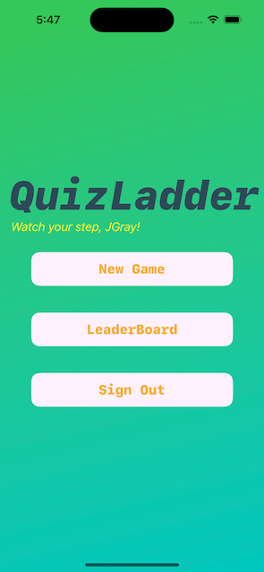
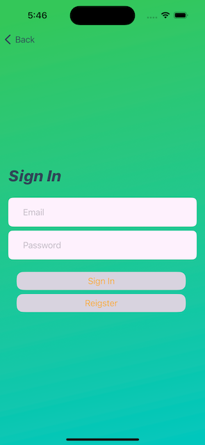
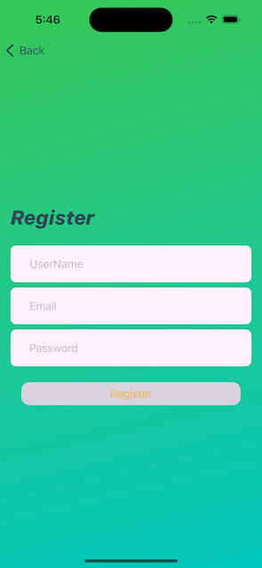
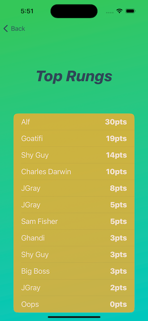
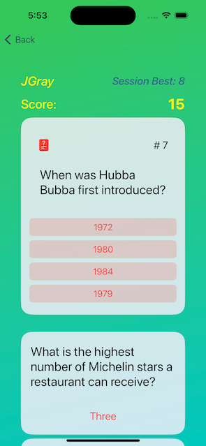
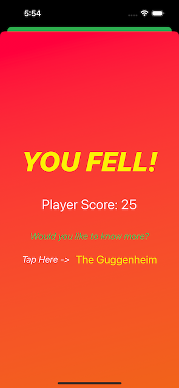

#  QuizLadder

## Intro

QuizLadder is an iOS App developed for my CPSC 5340 final project.  

This is a quiz game that will test users with increasingly difficult questions.  Each question is scored based on difficulty. As the user answers more questions the game will pull additional results from the Open Trivai Database API. New questions are stacked ontop of the previous ones and the player answers questions until he misses one. At which point the player "falls" off of the ladder, and the game ends. Players can tap on the provided answer and open a Google search link for the question they missed.

The application utilizes Goolge Firebase for user authentication, and Firestore for tracking the scores of all players.

## Main Menu

## Sign In and Registration

## Leaderboard

## GameBoard

